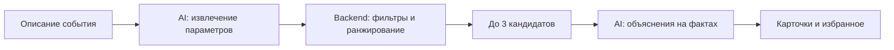

# ToiTap

### Подрядчики для вашего мероприятия.

**Сайт: [toi-tap.aribzhan.kz](https://toi-tap.aribzhan.kz)**

**React 19 · TypeScript · FastAPI · OpenAI**

Хакатон-проект команды **Qadam Tech**.

**[Быстрый старт](#быстрый-старт)** · **[Как работает AI](#как-работает-ai)** · **[Демо-запросы](#демо-запросы)** · **[Backend API](backend/README.md)**

ToiTap помогает найти подрядчиков для мероприятия: расскажите о планах обычным текстом, получите до трёх подходящих вариантов и узнайте, почему каждый из них оказался в подборке.

Вместо длинного каталога — короткий список с конкретными фактами: стоимость, доступность, язык, длительность и детали из описания профиля.

> Хакатон-проект Qadam Tech, задача #79-lite. Каталог содержит 66 анонимизированных профилей, включая 13 синтетических. Это демонстрационный подбор, без бронирования и оплаты. Фотографии иллюстрируют категории услуг и не изображают конкретных подрядчиков.

## Preview


Интерфейс адаптируется к размеру экрана: одна колонка карточек на телефоне, две на планшете, три на широком экране. Проверены ширины **320, 375, 390, 768, 1024 и 1440 px**, включая открытый календарь. Это проверка размеров viewport, а не сертификация всех устройств и браузеров.

## Возможности

- **Поиск обычным текстом.** Город, дата, формат, категория и бюджет извлекаются из запроса; язык и длительность можно уточнить дополнительно.
- **До трёх рекомендаций.** Занятые на дату, превышающие бюджет и не подходящие под условия профили исключаются до формирования подборки.
- **Объяснение к каждой карточке.** Цена относительно бюджета, особенности предложения и факты из описания помогают сравнивать варианты.
- **Понятный пустой результат.** Сервис различает отсутствие категории в городе и отсутствие подходящих кандидатов; показывает причины исключения.
- **Личный список.** Избранное открывается отдельным представлением без баннера, поиска и фильтров. Сохранение — в localStorage этого браузера.
- **Карточка профиля.** Описание, языки, форматы, стартовая цена и ограничения по времени доступны в модальном окне.
- **Светлая и тёмная темы.** Адаптивный интерфейс с локальными тематическими фотографиями, календарём и фильтрами.
- **Работа без AI-ключа.** Разбор по правилам и шаблонные объяснения сохраняют доступность поиска.

## Дизайн

Светлый фон, глубокий зелёный акцент, типографика Manrope и крупные фотографии создают спокойный интерфейс для планирования события.

| Элемент | Значение |
| --- | --- |
| Основной фон | `#FAFBF8` |
| Акцент и основные действия | `#075B43` |
| Основной текст | `#203B31` |
| Мягкие поверхности | `#F1F5EF` |
| Шрифт | Manrope |

Фотографии хранятся в `frontend/public/images` и загружаются с самого приложения. На карточках они отмечены как изображения для вдохновения. Шрифт загружается через Google Fonts; при недоступности используется системный sans-serif.

**Designed by Qadam Tech.**

## Как работает AI



1. **Понимает запрос.** `/api/parse` преобразует текст в структурированные параметры. Значения приводятся к категориям каталога; недостающие распознанные значения дополняются разбором по правилам.
2. **Отбирает по условиям.** Backend проверяет город, категорию, занятость, цену, формат, язык и максимальную длительность.
3. **Ранжирует воспроизводимо.** Порядок определяет алгоритм: упоминание формата в описании, полнота исходных данных, запас бюджета, язык и часы. При равном балле используется ID.
4. **Объясняет выбор.** OpenAI получает только отобранные профили и факты для объяснения. AI не выбирает кандидатов и не меняет их порядок.
5. **Обрабатывает сбои.** При ошибке или таймауте AI используются правила и шаблоны. Повторные запросы кэшируются в памяти backend.

Поле `source: "llm"` подтверждает AI-разбор, а `explanation_source: "llm"` — AI-объяснение конкретной карточки. В интерфейсе это отдельные индикаторы. `/api/health` с `llm: true` означает наличие ключа, но не гарантирует успешный ответ модели.

Модель по умолчанию — `gpt-4.1-mini`. Изменить её и таймаут можно в локальном `.env`.

## Данные и ограничения

- **66 профилей, 17 категорий**, города каталога: Алматы, Астана и «Зарубежье».
- Доступное окно дат: **23 сентября — 31 декабря 2026 года**.
- Синтетические профили отмечены; восстановленные цены отображаются как ориентировочные.
- Стоимость — начальная цена услуги, не подтверждённая итоговая смета.
- `max_hours: null` означает отсутствие ограничения по часам присутствия.
- Если никто не подходит, условия автоматически не смягчаются. Нужно изменить бюджет, дату, формат или категорию.
- Неуказанные в новом тексте параметры сохраняются из текущих фильтров. Перед независимым сценарием проверьте язык и длительность.
- Избранное хранит результат прошлого поиска: доступность нужно проверять повторно.
- Объяснения AI требуют проверки: возможны неточности формулировок и сравнения цен.

## Быстрый старт

Нужны **Python 3.12+**, **Node.js 22.12+** и npm.

```bash
git clone --branch main git@github.com:BAITC-Hacks/hack-c1535a6c-qadam-tech.git
cd hack-c1535a6c-qadam-tech
```

В первом терминале запустите backend:

```bash
cd backend
python3 -m venv .venv
.venv/bin/pip install -r requirements.txt
cp .env.example .env
# Для AI заполните OPENAI_API_KEY в .env локально.
.venv/bin/uvicorn app.main:app --host 127.0.0.1 --port 8765
```

Во втором терминале запустите frontend из папки проекта:

```bash
cd frontend
npm ci
npm run dev -- --host 127.0.0.1 --port 5173
```

- Приложение: [localhost:5173](http://localhost:5173)
- Swagger: [localhost:8765/docs](http://localhost:8765/docs)
- Состояние API: [localhost:8765/api/health](http://localhost:8765/api/health)

Vite перенаправляет `/api` на backend. После изменения `.env` перезапустите backend. Если `.env` уже существует, не заменяйте его копированием примера.

## Демо-запросы

Скопируйте один запрос в строку поиска. Ожидаемые результаты относятся к текущему датасету без дополнительных ограничений языка и длительности.

| Запрос | Ожидаемый результат |
| --- | --- |
| Нужен ведущий на свадьбу в Алматы 15 октября 2026 года, бюджет до 1 500 000 тенге. | Кики, Эмилия, Мицури Канроджи — 3 карточки |
| Нужен флорист на свадьбу в Алматы 14 ноября 2026 года, бюджет до 500 000 тенге. | Тихиро Огино — 1 карточка, второй флорист занят |
| Нужен отель для свадьбы в Алматы 30 сентября 2026 года, бюджет до 3 500 000 тенге. | Гохан — 1 карточка, от 3 200 000 ₸ |
| Нужен декоратор на свадьбу в Астане 14 ноября 2026 года, бюджет до 3 000 000 тенге. | Категории нет в городе |

## Техническая структура

| Слой | Технологии и ответственность |
| --- | --- |
| Frontend | React 19, TypeScript, Vite, Tailwind CSS, Lucide |
| API | FastAPI, Pydantic, Uvicorn |
| Подбор | Python, pandas, CSV → JSON-кэш, детерминированный скоринг |
| AI | OpenAI Responses API, структурированный вывод, fallback и кэш |
| Проверки | pytest, Node.js test runner, TypeScript и production build |

```text
backend/
  app/main.py          API и валидация
  app/data.py          Загрузка и нормализация каталога
  app/search.py        Фильтрация, причины исключения, скоринг
  app/llm.py           AI-интеграция, кэш и fallback
  app/ai/              Промпты, разбор запроса и объяснения
  data/dataset.csv     Исходные данные
  tests/               Тесты подбора и AI-модуля
frontend/
  public/images/       Статические иллюстрации категорий
  src/main.tsx         Поиск, карточки, избранное и темы
  src/api.ts           Контракты API и проверка параметров
  src/DatePicker.tsx   Календарь
  src/style.css        Визуальная система
```

## Проверки

```bash
# Из корня проекта
cd backend
.venv/bin/python -m pytest -q
.venv/bin/python demo.py                 # backend должен быть запущен

cd ../frontend
npm test
npm run build
```

Текущий набор: **22 backend-теста и 4 frontend-теста**. Демо проверяет шесть сценариев через работающий API. Unit-тесты не заменяют проверку реального OpenAI-запроса.

## Конфигурация и приватность

`backend/.env` исключён из Git правилами `.gitignore`. В репозитории хранится только `.env.example` без ключа. API-ключ используется исключительно backend и не должен попадать в frontend, скриншоты или коммиты.

С включённым AI текст запроса и данные выбранных профилей отправляются в OpenAI; клиент указывает `store=False`. Избранное и выбранная тема сохраняются локально в браузере. Сервис не реализует регистрацию, бронирование, оплату или отправку сообщений подрядчикам.

## Дальнейшее развитие

- [x] Подбор с учётом условий и занятости
- [x] AI-разбор текста и объяснения с fallback
- [x] Избранное, темы и адаптивные карточки
- [ ] Улучшение сравнений цен в AI-объяснениях
- [ ] Явное уведомление при переходе на шаблон после таймаута
- [ ] Предложение альтернативных условий при пустом результате

## Команда и материалы

**Qadam Tech** — backend и данные, frontend и дизайн, AI-интеграция.

Фотографии: [Unsplash](https://unsplash.com). Источники локальных изображений перечислены в [frontend/public/images/README.md](frontend/public/images/README.md).
